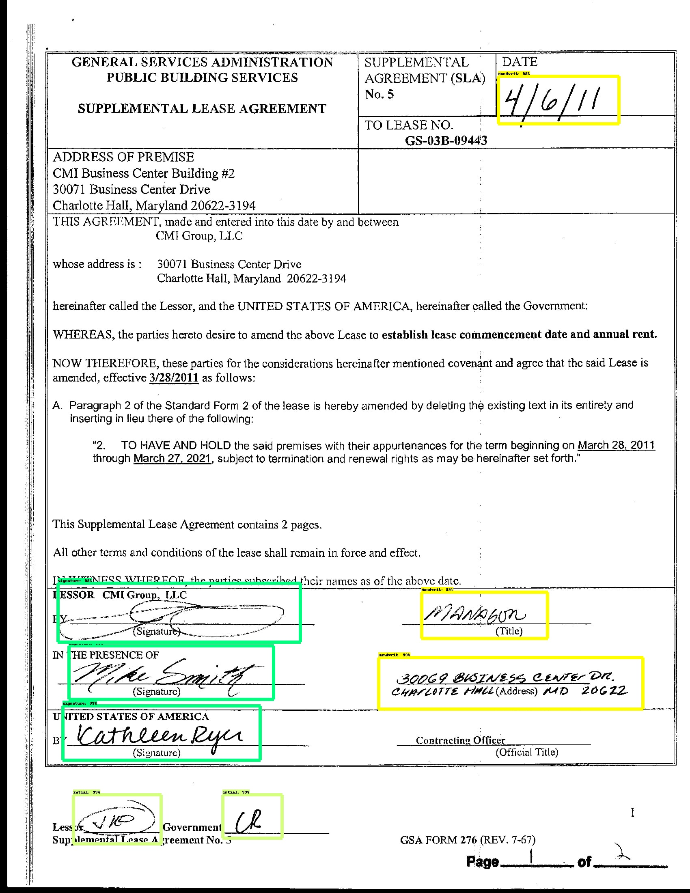

# detection-in-contract-management

Le but de ce référentiel est de vous fournir, un guide pratique montrant comment vous pouvez rapidement créer un ensemble de données et former un modèle de détection d'objet personnalisé pour la détection des signatures et intials, et écritures manuscrites.

ces deux fichies décrit toutes les étapes nécessaires pour démarrer avec votre propre classificateur de détection d'objets.
- [`Article 1`](https://github.com/rachikbilal/detection-in-contract-management/blob/master/Handwriting%2Csignatures%20and%20initials%20%20detection%20in%20contract%20management%20%20part%201.ipynb) 
- [`Article 2`](https://github.com/) 

et aussi Ce référentiel contient un fichier Python Google Colab qui vous permet de monter des dossiers sur  Google Drive et d'exécuter votre propre classificateur de détection d'objets.

- [`Article 3`](https://github.com/rachikbilal/detection-in-contract-management/blob/master/object-detection.ipynb)

